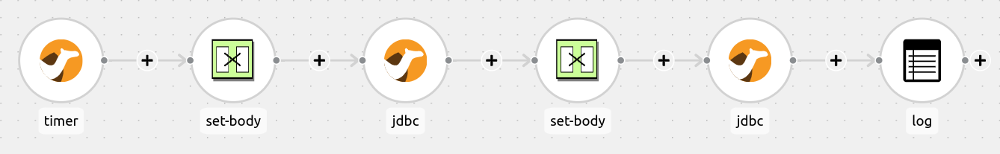

:walkthrough: Lab Introduction
:user-password: openshift
:namespace: {user-username}

:experimental:

:article-url: https://developers.redhat.com/articles/2023/08/15/some-article-url

ifdef::env-github[]
endif::[]

[id='lab-intro']
= Camel Quarkus - JDBC DataSource Lab

An example that shows how to connect to a Database using a data source.

This hands-on lab is based on the following blog article in Red Hat Developers:

* link:{article-url}[window="_blank", , id="rhd-source-article"]

{empty} +

Assuming you have followed the article's instructions, you should be all set to get hands-on with the _Camel Quarkus_ in the _OpenShift Dev Spaces_ workspace.

For illustration purposes, the picture below shows what the integration end-to-end flow looks like.

Data is periodically inserted into a data store and then queried to display a running count of the records.

{empty} +

[time=1]
[id="section-one"]
== Explore the source code

All the source code for this example can be found in the project explorer under the `jdbc-datasource` directory.

=== Routes

Start by opening the route definition in the following file:

--
`src/main/java/org/acme/jdbc/JdbcRoutes.java`
--

The first half of the route inserts records into the databsae:

[source,java,linenums]
----
from("timer://insertCamel?period=1000")
        .log("Inserting Camel ${messageTimestamp}")
        .setBody().simple("INSERT INTO camel (timestamp) VALUES (${messageTimestamp})")
        .to("jdbc:camel-ds")
----

. The `timer` component sends a message every 1000 milliseconds.
. The unix timestamp of the message, identified with `${messageTimestamp}` in the Simple language, is logged to the console.
. The message body is populated with an `INSERT` statement. The `messageTimestamp` value will be inserted into the `timestamp` column in the `camel` table.
. The `jdbc` component executes the statement in the message body on the data source referenced by the `camel-ds` identifier.

The second half retrieves all the records and logs the count and individual entries:

[source,java,linenums]
----
        .setBody().simple("SELECT * FROM camel")
        .to("jdbc:camel-ds")
        .log("We have ${header[CamelJdbcRowCount]} camels in the database.")
        .log("Camels found: ${body}");
----

The second half of the route is very similar to the first half, although this time a SQL `SELECT` query is passed to the `jdbc` component. 

=== Database Set-up

The `camel` table used by the above SQL statements is created in the following class:

--
`src/main/java/org/acme/jdbc/JdbcResource.java`
--

The `JdbcResource` class implements the `startup` observer method, which will be invoked by Quarkus during the example's startup phase. A connection is established to the `camel-ds` Agroal DataSource that was injected into the class. The method then executes two SQL statements, first dropping the `camel` table if it already exists to avoid reusing data from previous runs; and then creating the table.

=== Application Properties

The database connection properties are specified in the `src/main/resources/application.properties` file.

When running locally, the H2 database is used, and Quarkus will use Dev Services to automatically start up a database instance. However, when running in OpenShift Dev Spaces, Dev Services doesn't work due to limitations with starting containers within a container. Instead, the `k8s` profile is used to define the connection parameters to a MySql database. These properties are defined below:

[source]
----
%k8s.quarkus.datasource.camel-ds.db-kind=mysql
%k8s.quarkus.datasource.camel-ds.username=cquser
%k8s.quarkus.datasource.camel-ds.password=cqpass
%k8s.quarkus.datasource.camel-ds.jdbc.url=jdbc:mysql://localhost:3306/testdb
----

{empty} +

[time=3]
[id="section-two"]
== Run the example

The example can either be launched in OpenShift Dev Spaces by running a VS Code task, or entering commands directly in a terminal.

To start the example from a task, open the menu and selecting `Terminal > Run Task...` and then select `devfile: start-jdbc-datasource`.

Alternatively, you can open a terminal from the menu by selecting `Terminal > New Terminal (Select a container)` and selecting the `tools` container. Then copy and paste the following commands:

[source, subs=]
----
cd /projects/examples/jdbc-datasource
mvn -Dquarkus.profile=k8s clean quarkus:dev
----

After a few seconds, you should start seeing output similar to the following:

[source]
----
2023-10-13 10:54:26,199 INFO  [route1] (Camel (camel-1) thread #1 - timer://insertCamel) Inserting Camel 1697194460199
2023-10-13 10:54:26,202 INFO  [route1] (Camel (camel-1) thread #1 - timer://insertCamel) Inserted Camel 1697194460199
2023-10-13 10:54:26,205 INFO  [route1] (Camel (camel-1) thread #1 - timer://insertCamel) We have 3 camels in the database.
2023-10-13 10:54:26,206 INFO  [route1] (Camel (camel-1) thread #1 - timer://insertCamel) Camels found: [{id=1, timestamp=1697194458198}, {id=2, timestamp=1697194459199}, {id=3, timestamp=1697194460199}]
----

{empty} +

[type=verification]
Did you obtain similar log messages to the output shown above?

[type=verificationSuccess]
You've successfully run the example !!

[type=verificationFail]
Inspect the logs to investigate possible causes of failure.
